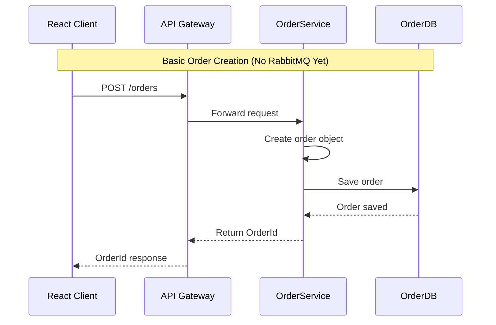
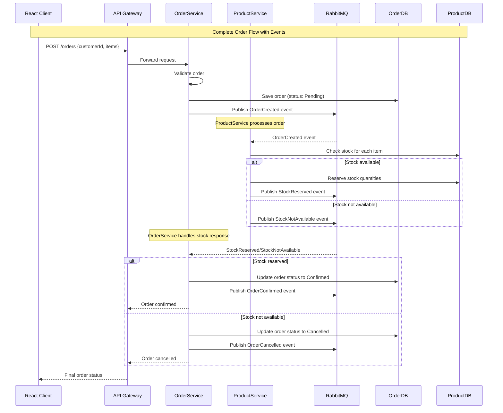
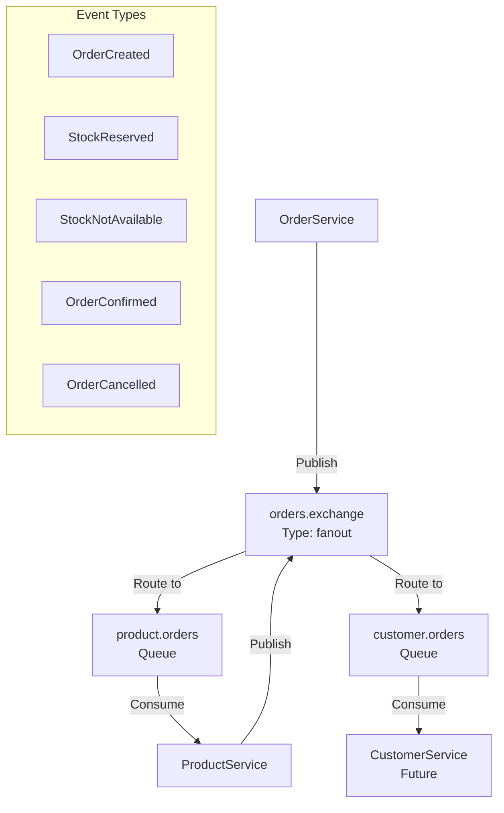

# Implementation Guide: Event-Driven Order System

This guide will help you implement a complete order workflow using RabbitMQ for service communication.

## 🎯 Learning Goals

- Understand microservices communication patterns
- Implement event-driven architecture
- Learn RabbitMQ messaging patterns
- Build a real-world order system

## 🔄 Complete Flow Overview

## 🔄 Current Simple Flow (Phase 1-2)


## 🎯 Target Flow with RabbitMQ (Phase 3-4)  


## 🏗️ RabbitMQ Exchange/Queue Structure


## 📋 Step-by-Step Implementation

### Step 1: Install RabbitMQ Dependencies

Add to all service projects:

```bash
cd ProductService
dotnet add package RabbitMQ.Client
dotnet add package Microsoft.Extensions.Hosting

cd ../OrderService  
dotnet add package RabbitMQ.Client
dotnet add package Microsoft.Extensions.Hosting

cd ../CustomerService
dotnet add package RabbitMQ.Client
dotnet add package Microsoft.Extensions.Hosting
```

### Step 2: Create Domain Events

Create shared event contracts in each service:

#### ProductService/Domain/Events/

```csharp
// ProductService/Domain/Events/OrderCreated.cs
public record OrderCreated(
    Guid OrderId,
    Guid CustomerId,
    Guid ProductId,
    int Quantity,
    DateTime CreatedAt
);

// ProductService/Domain/Events/StockReserved.cs
public record StockReserved(
    Guid OrderId,
    Guid ProductId,
    int ReservedQuantity,
    DateTime ReservedAt
);

// ProductService/Domain/Events/StockNotAvailable.cs
public record StockNotAvailable(
    Guid OrderId,
    Guid ProductId,
    int RequestedQuantity,
    int AvailableQuantity
);
```

#### OrderService/Domain/Events/

```csharp
// OrderService/Domain/Events/OrderCreated.cs
public record OrderCreated(
    Guid OrderId,
    Guid CustomerId,
    Guid ProductId,
    int Quantity,
    DateTime CreatedAt
);

// OrderService/Domain/Events/OrderConfirmed.cs
public record OrderConfirmed(
    Guid OrderId,
    Guid CustomerId,
    DateTime ConfirmedAt
);

// OrderService/Domain/Events/OrderCancelled.cs
public record OrderCancelled(
    Guid OrderId,
    Guid CustomerId,
    string Reason,
    DateTime CancelledAt
);
```

### Step 3: Create RabbitMQ Infrastructure

#### Shared/Infrastructure/Messaging/

```csharp
// IRabbitMQPublisher.cs
public interface IRabbitMQPublisher
{
    Task PublishAsync<T>(T message, string routingKey) where T : class;
}

// RabbitMQPublisher.cs
public class RabbitMQPublisher : IRabbitMQPublisher
{
    private readonly IConnection _connection;
    private readonly IModel _channel;
    private readonly ILogger<RabbitMQPublisher> _logger;

    public RabbitMQPublisher(IConfiguration configuration, ILogger<RabbitMQPublisher> logger)
    {
        _logger = logger;
        var factory = new ConnectionFactory()
        {
            HostName = configuration["RabbitMQ:Host"] ?? "localhost",
            UserName = configuration["RabbitMQ:Username"] ?? "guest",
            Password = configuration["RabbitMQ:Password"] ?? "guest"
        };

        _connection = factory.CreateConnection();
        _channel = _connection.CreateModel();
        
        // Declare exchange
        _channel.ExchangeDeclare("orders.exchange", ExchangeType.Topic, durable: true);
    }

    public async Task PublishAsync<T>(T message, string routingKey) where T : class
    {
        var json = JsonSerializer.Serialize(message);
        var body = Encoding.UTF8.GetBytes(json);

        _channel.BasicPublish(
            exchange: "orders.exchange",
            routingKey: routingKey,
            basicProperties: null,
            body: body);

        _logger.LogInformation("Published message {MessageType} with routing key {RoutingKey}", 
            typeof(T).Name, routingKey);
    }
}

// IRabbitMQConsumer.cs
public interface IRabbitMQConsumer
{
    void Subscribe<T>(string queueName, string routingKey, Func<T, Task> handler) where T : class;
}

// RabbitMQConsumer.cs
public class RabbitMQConsumer : IRabbitMQConsumer, IDisposable
{
    private readonly IConnection _connection;
    private readonly IModel _channel;
    private readonly ILogger<RabbitMQConsumer> _logger;

    public RabbitMQConsumer(IConfiguration configuration, ILogger<RabbitMQConsumer> logger)
    {
        _logger = logger;
        var factory = new ConnectionFactory()
        {
            HostName = configuration["RabbitMQ:Host"] ?? "localhost",
            UserName = configuration["RabbitMQ:Username"] ?? "guest",
            Password = configuration["RabbitMQ:Password"] ?? "guest"
        };

        _connection = factory.CreateConnection();
        _channel = _connection.CreateModel();
        
        // Declare exchange
        _channel.ExchangeDeclare("orders.exchange", ExchangeType.Topic, durable: true);
    }

    public void Subscribe<T>(string queueName, string routingKey, Func<T, Task> handler) where T : class
    {
        _channel.QueueDeclare(queueName, durable: true, exclusive: false, autoDelete: false);
        _channel.QueueBind(queueName, "orders.exchange", routingKey);

        var consumer = new EventingBasicConsumer(_channel);
        consumer.Received += async (model, ea) =>
        {
            try
            {
                var body = ea.Body.ToArray();
                var json = Encoding.UTF8.GetString(body);
                var message = JsonSerializer.Deserialize<T>(json);

                await handler(message);
                _channel.BasicAck(ea.DeliveryTag, false);
                
                _logger.LogInformation("Processed message {MessageType} from queue {Queue}", 
                    typeof(T).Name, queueName);
            }
            catch (Exception ex)
            {
                _logger.LogError(ex, "Error processing message from queue {Queue}", queueName);
                _channel.BasicNack(ea.DeliveryTag, false, true);
            }
        };

        _channel.BasicConsume(queueName, false, consumer);
    }

    public void Dispose()
    {
        _channel?.Dispose();
        _connection?.Dispose();
    }
}
```

### Step 4: Implement OrderService

#### OrderService/Controllers/OrdersController.cs

```csharp
[ApiController]
[Route("api/[controller]")]
public class OrdersController : ControllerBase
{
    private readonly IRabbitMQPublisher _publisher;
    private readonly ILogger<OrdersController> _logger;

    public OrdersController(IRabbitMQPublisher publisher, ILogger<OrdersController> logger)
    {
        _publisher = publisher;
        _logger = logger;
    }

    [HttpPost]
    public async Task<ActionResult<Guid>> CreateOrder([FromBody] CreateOrderRequest request)
    {
        var orderId = Guid.NewGuid();
        
        // Create order in database (implement your order repository)
        // var order = new Order { Id = orderId, CustomerId = request.CustomerId, ... };
        // await _orderRepository.AddAsync(order);

        // Publish OrderCreated event
        var orderCreated = new OrderCreated(
            orderId,
            request.CustomerId,
            request.ProductId,
            request.Quantity,
            DateTime.UtcNow
        );

        await _publisher.PublishAsync(orderCreated, "order.created");

        _logger.LogInformation("Order {OrderId} created for customer {CustomerId}", 
            orderId, request.CustomerId);

        return Ok(orderId);
    }
}

// CreateOrderRequest.cs
public record CreateOrderRequest(
    Guid CustomerId,
    Guid ProductId,
    int Quantity
);
```

#### OrderService/Services/OrderEventHandler.cs

```csharp
public class OrderEventHandler : BackgroundService
{
    private readonly IRabbitMQConsumer _consumer;
    private readonly IRabbitMQPublisher _publisher;
    private readonly ILogger<OrderEventHandler> _logger;

    public OrderEventHandler(
        IRabbitMQConsumer consumer, 
        IRabbitMQPublisher publisher,
        ILogger<OrderEventHandler> logger)
    {
        _consumer = consumer;
        _publisher = publisher;
        _logger = logger;
    }

    protected override Task ExecuteAsync(CancellationToken stoppingToken)
    {
        // Subscribe to stock events
        _consumer.Subscribe<StockReserved>("orders.stock.reserved", "stock.reserved", HandleStockReserved);
        _consumer.Subscribe<StockNotAvailable>("orders.stock.notavailable", "stock.notavailable", HandleStockNotAvailable);

        return Task.CompletedTask;
    }

    private async Task HandleStockReserved(StockReserved @event)
    {
        _logger.LogInformation("Stock reserved for order {OrderId}", @event.OrderId);

        // Update order status to confirmed
        // await _orderRepository.ConfirmOrderAsync(@event.OrderId);

        // Publish OrderConfirmed event
        var orderConfirmed = new OrderConfirmed(@event.OrderId, Guid.NewGuid(), DateTime.UtcNow);
        await _publisher.PublishAsync(orderConfirmed, "order.confirmed");
    }

    private async Task HandleStockNotAvailable(StockNotAvailable @event)
    {
        _logger.LogInformation("Stock not available for order {OrderId}", @event.OrderId);

        // Update order status to cancelled
        // await _orderRepository.CancelOrderAsync(@event.OrderId);

        // Publish OrderCancelled event
        var orderCancelled = new OrderCancelled(
            @event.OrderId, 
            Guid.NewGuid(), 
            "Stock not available", 
            DateTime.UtcNow);
        await _publisher.PublishAsync(orderCancelled, "order.cancelled");
    }
}
```

### Step 5: Implement ProductService Stock Management

#### ProductService/Services/ProductEventHandler.cs

```csharp
public class ProductEventHandler : BackgroundService
{
    private readonly IRabbitMQConsumer _consumer;
    private readonly IRabbitMQPublisher _publisher;
    private readonly IProductService _productService;
    private readonly ILogger<ProductEventHandler> _logger;

    public ProductEventHandler(
        IRabbitMQConsumer consumer,
        IRabbitMQPublisher publisher,
        IProductService productService,
        ILogger<ProductEventHandler> logger)
    {
        _consumer = consumer;
        _publisher = publisher;
        _productService = productService;
        _logger = logger;
    }

    protected override Task ExecuteAsync(CancellationToken stoppingToken)
    {
        _consumer.Subscribe<OrderCreated>("products.order.created", "order.created", HandleOrderCreated);
        return Task.CompletedTask;
    }

    private async Task HandleOrderCreated(OrderCreated @event)
    {
        _logger.LogInformation("Processing order {OrderId} for product {ProductId}, quantity {Quantity}", 
            @event.OrderId, @event.ProductId, @event.Quantity);

        // Check stock availability
        var product = await _productService.GetProductByIdAsync(@event.ProductId);
        if (product == null)
        {
            var stockNotAvailable = new StockNotAvailable(@event.OrderId, @event.ProductId, @event.Quantity, 0);
            await _publisher.PublishAsync(stockNotAvailable, "stock.notavailable");
            return;
        }

        // Get current stock (implement this in your product service)
        var currentStock = await _productService.GetStockQuantityAsync(@event.ProductId);
        
        if (currentStock >= @event.Quantity)
        {
            // Reserve stock
            await _productService.ReserveStockAsync(@event.ProductId, @event.Quantity);
            
            var stockReserved = new StockReserved(@event.OrderId, @event.ProductId, @event.Quantity, DateTime.UtcNow);
            await _publisher.PublishAsync(stockReserved, "stock.reserved");
            
            _logger.LogInformation("Stock reserved for order {OrderId}", @event.OrderId);
        }
        else
        {
            var stockNotAvailable = new StockNotAvailable(@event.OrderId, @event.ProductId, @event.Quantity, currentStock);
            await _publisher.PublishAsync(stockNotAvailable, "stock.notavailable");
            
            _logger.LogWarning("Insufficient stock for order {OrderId}. Requested: {Requested}, Available: {Available}", 
                @event.OrderId, @event.Quantity, currentStock);
        }
    }
}
```

### Step 6: Implement CustomerService

#### CustomerService/Services/CustomerEventHandler.cs

```csharp
public class CustomerEventHandler : BackgroundService
{
    private readonly IRabbitMQConsumer _consumer;
    private readonly ICustomerService _customerService;
    private readonly ILogger<CustomerEventHandler> _logger;

    public CustomerEventHandler(
        IRabbitMQConsumer consumer,
        ICustomerService customerService,
        ILogger<CustomerEventHandler> logger)
    {
        _consumer = consumer;
        _customerService = customerService;
        _logger = logger;
    }

    protected override Task ExecuteAsync(CancellationToken stoppingToken)
    {
        _consumer.Subscribe<OrderCreated>("customers.order.created", "order.created", HandleOrderCreated);
        _consumer.Subscribe<OrderConfirmed>("customers.order.confirmed", "order.confirmed", HandleOrderConfirmed);
        _consumer.Subscribe<OrderCancelled>("customers.order.cancelled", "order.cancelled", HandleOrderCancelled);

        return Task.CompletedTask;
    }

    private async Task HandleOrderCreated(OrderCreated @event)
    {
        _logger.LogInformation("Order {OrderId} created for customer {CustomerId}", 
            @event.OrderId, @event.CustomerId);

        // Add order to customer history
        await _customerService.AddOrderToHistoryAsync(@event.CustomerId, @event.OrderId, "Pending");
    }

    private async Task HandleOrderConfirmed(OrderConfirmed @event)
    {
        _logger.LogInformation("Order {OrderId} confirmed for customer {CustomerId}", 
            @event.OrderId, @event.CustomerId);

        // Update order status in customer history
        await _customerService.UpdateOrderStatusAsync(@event.CustomerId, @event.OrderId, "Confirmed");
    }

    private async Task HandleOrderCancelled(OrderCancelled @event)
    {
        _logger.LogInformation("Order {OrderId} cancelled for customer {CustomerId}. Reason: {Reason}", 
            @event.OrderId, @event.CustomerId, @event.Reason);

        // Update order status in customer history
        await _customerService.UpdateOrderStatusAsync(@event.CustomerId, @event.OrderId, "Cancelled");
    }
}
```

### Step 7: Configure Services

Add to each service's `Program.cs`:

```csharp
// Program.cs (for all services)
builder.Services.AddSingleton<IRabbitMQPublisher, RabbitMQPublisher>();
builder.Services.AddSingleton<IRabbitMQConsumer, RabbitMQConsumer>();

// Register event handlers
builder.Services.AddHostedService<OrderEventHandler>();      // OrderService
builder.Services.AddHostedService<ProductEventHandler>();   // ProductService  
builder.Services.AddHostedService<CustomerEventHandler>();  // CustomerService
```

Add RabbitMQ configuration to `appsettings.json`:

```json
{
  "RabbitMQ": {
    "Host": "localhost",
    "Username": "guest",
    "Password": "guest"
  }
}
```

### Step 8: Add Ocelot Routes

Update `ApiGateway/ocelot.json`:

```json
{
  "Routes": [
    {
      "DownstreamPathTemplate": "/api/products/{everything}",
      "DownstreamScheme": "http",
      "DownstreamHostAndPorts": [{ "Host": "localhost", "Port": 5232 }],
      "UpstreamPathTemplate": "/products/{everything}",
      "UpstreamHttpMethod": [ "GET", "POST", "PUT", "DELETE" ]
    },
    {
      "DownstreamPathTemplate": "/api/orders/{everything}",
      "DownstreamScheme": "http", 
      "DownstreamHostAndPorts": [{ "Host": "localhost", "Port": 5003 }],
      "UpstreamPathTemplate": "/orders/{everything}",
      "UpstreamHttpMethod": [ "GET", "POST", "PUT", "DELETE" ]
    },
    {
      "DownstreamPathTemplate": "/api/customers/{everything}",
      "DownstreamScheme": "http",
      "DownstreamHostAndPorts": [{ "Host": "localhost", "Port": 5002 }],
      "UpstreamPathTemplate": "/customers/{everything}",
      "UpstreamHttpMethod": [ "GET", "POST", "PUT", "DELETE" ]
    }
  ],
  "GlobalConfiguration": {
    "BaseUrl": "http://localhost:5108"
  }
}
```

## 🧪 Testing the Flow

### 1. Start all services
```bash
# Terminal 1: RabbitMQ
docker run -d --hostname rabbitmq --name rabbitmq-server -p 5672:5672 -p 15672:15672 rabbitmq:3-management

# Terminal 2: API Gateway
cd ApiGateway && dotnet run

# Terminal 3: ProductService  
cd ProductService && dotnet run

# Terminal 4: OrderService
cd OrderService && dotnet run

# Terminal 5: CustomerService
cd CustomerService && dotnet run
```

### 2. Create a test order
```bash
curl -X POST http://localhost:5108/orders \
  -H "Content-Type: application/json" \
  -d '{
    "customerId": "550e8400-e29b-41d4-a716-446655440000",
    "productId": "550e8400-e29b-41d4-a716-446655440001", 
    "quantity": 2
  }'
```

### 3. Monitor RabbitMQ
- Open http://localhost:15672 (guest/guest)
- Watch queues and exchanges
- See message flow between services

## 🎯 What You'll Learn

1. **Event-driven architecture** - How services communicate asynchronously
2. **Message patterns** - Publisher/Subscriber, Request/Reply
3. **Eventual consistency** - How distributed systems maintain data consistency
4. **Resilience** - Error handling and retry mechanisms
5. **Monitoring** - Observing distributed system behavior

This implementation gives you hands-on experience with real-world microservices patterns!