# Microservices Learning Project

A comprehensive microservices architecture implementation using .NET Core and React, featuring API Gateway, Product Service, and multiple other services with a modern frontend.

## 🏗️ Architecture Overview

## 🔄 Current State (What You Have Now)

```mermaid
graph TD
    A[React Frontend<br/>Port: 5173] -->|HTTP| B[API Gateway<br/>Ocelot<br/>Port: 5108]
    
    B -->|/products/*| C[ProductService ✅<br/>Port: 5232<br/>Fully Implemented]
    B -.->|/orders/*| D[OrderService ❌<br/>Port: 5003<br/>Template Only]
    B -.->|/customers/*| E[CustomerService ❌<br/>Port: 5002<br/>Template Only]
    B -.->|/auth/*| F[AuthService ❌<br/>Port: 5001<br/>Template Only]
    
    C -->|EF Core| G[(ProductDB<br/>PostgreSQL)]
    
    subgraph "Working Services"
        A
        B  
        C
    end
    
    subgraph "To Be Implemented"
        D
        E
        F
        H[RabbitMQ<br/>Not Connected]
    end
    
    subgraph "Database"
        G
    end
```


## 🎯 Target State (What We'll Build)


## 📋 Services Overview

### 🌐 API Gateway (Ocelot)
- **Port**: 5108
- **Technology**: .NET Core + Ocelot
- **Purpose**: Single entry point for all client requests
- **Features**:
  - Request routing to appropriate microservices
  - CORS configuration for frontend
  - Load balancing and service discovery ready

### 🛍️ ProductService
- **Port**: 5232
- **Technology**: .NET Core Web API
- **Database**: PostgreSQL
- **Architecture**: Clean Architecture (Domain, Application, Infrastructure)
- **Features**:
  - Product management
  - Category and location tracking
  - Stock and warehouse management
  - Repository pattern with Unit of Work
  - Entity Framework Core with migrations

### 🔐 AuthService
- **Port**: 5001
- **Technology**: .NET Core Web API
- **Purpose**: Authentication and authorization

### 👥 CustomerService
- **Port**: 5002
- **Technology**: .NET Core Web API
- **Purpose**: Customer management

### 📦 OrderService
- **Port**: 5003
- **Technology**: .NET Core Web API
- **Purpose**: Order processing and management

### 🎨 Frontend (React)
- **Port**: 5173
- **Technology**: React 19 + TypeScript + Vite
- **UI Library**: Ant Design
- **Features**:
  - Product table management
  - Category and location views
  - Responsive design
  - Environment-based API configuration

## 🚀 Quick Start

### Prerequisites
- .NET 8 SDK
- Node.js 18+
- PostgreSQL
- RabbitMQ
- Visual Studio Code or Visual Studio

### 1. Infrastructure Setup
```bash
# Start PostgreSQL service
# Create database for ProductService

# Start RabbitMQ
docker run -d --hostname rabbitmq --name rabbitmq-server \
  -p 5672:5672 -p 15672:15672 \
  rabbitmq:3-management

# RabbitMQ Management UI: http://localhost:15672
# Default credentials: guest/guest
```

### 2. Backend Services

#### Start API Gateway
```bash
cd ApiGateway
dotnet run
# Runs on http://localhost:5108
```

#### Start ProductService
```bash
cd ProductService
dotnet run
# Runs on http://localhost:5232
```

#### Start Other Services (Optional)
```bash
# AuthService
cd AuthService
dotnet run

# CustomerService  
cd CustomerService
dotnet run

# OrderService
cd OrderService
dotnet run
```

### 3. Frontend
```bash
cd client
npm install
npm run dev
# Runs on http://localhost:5173
```

## 🔧 Configuration

### Environment Variables

#### Frontend (.env.local)
```env
VITE_API_URL=http://localhost:5108
VITE_DEBUG=true
```

#### ProductService (appsettings.Development.json)
```json
{
  "ConnectionStrings": {
    "DefaultConnection": "Host=localhost;Database=ProductDB;Username=postgres;Password=your_password"
  }
}
```

### API Gateway Routes (ocelot.json)
```json
{
  "Routes": [
    {
      "DownstreamPathTemplate": "/api/products/{everything}",
      "DownstreamScheme": "http",
      "DownstreamHostAndPorts": [
        { "Host": "localhost", "Port": 5232 }
      ],
      "UpstreamPathTemplate": "/products/{everything}",
      "UpstreamHttpMethod": [ "GET", "POST", "PUT", "DELETE" ]
    }
  ],
  "GlobalConfiguration": {
    "BaseUrl": "http://localhost:5108"
  }
}
```

## 📁 Project Structure

```
learn-ms/
├── ApiGateway/                 # Ocelot API Gateway
│   ├── Program.cs
│   ├── ocelot.json
│   └── Properties/
├── ProductService/             # Product microservice
│   ├── Api/Controllers/        # API controllers
│   ├── Application/           # Business logic layer
│   │   ├── DTOs/
│   │   ├── IServices/
│   │   └── Services/
│   ├── Domain/                # Domain entities
│   │   ├── Entities/
│   │   ├── Repositories/
│   │   └── UnitOfWork/
│   ├── Infrastructure/        # Data access layer
│   │   ├── Repositories/
│   │   └── UnitOfWork/
│   └── Migrations/
├── AuthService/               # Authentication service
├── CustomerService/           # Customer management
├── OrderService/             # Order processing
├── client/                   # React frontend
│   ├── src/
│   │   ├── components/
│   │   ├── services/
│   │   └── types/
│   └── package.json
└── OrderMicroservices.sln    # Solution file
```

## 🔄 Request Flow

### Synchronous Communication (HTTP)
1. **Frontend Request**: React app makes HTTP request to `http://localhost:5108`
2. **API Gateway**: Ocelot receives request and matches route pattern
3. **Service Routing**: Gateway forwards request to appropriate microservice
4. **Service Processing**: Microservice processes request and returns response
5. **Response**: Gateway returns response to frontend

### Asynchronous Communication (RabbitMQ)
1. **Event Publishing**: Service publishes domain events to RabbitMQ
2. **Message Routing**: RabbitMQ routes messages to appropriate exchanges/queues
3. **Event Consumption**: Other services subscribe and consume relevant events
4. **Event Processing**: Services update their own data/state based on events

### Example Scenarios

#### Order Product Workflow
```
1. Customer places order via frontend
   POST /orders → OrderService

2. OrderService publishes events:
   - OrderCreated event → RabbitMQ
   - ProductReserved event → RabbitMQ

3. ProductService consumes ProductReserved:
   - Reduces stock quantity
   - Publishes StockUpdated event

4. CustomerService consumes OrderCreated:
   - Updates customer order history
   - Sends confirmation email
```

#### Get Products (Synchronous)
```
GET http://localhost:5108/products/all
  ↓ (API Gateway routes to)
GET http://localhost:5232/api/products/all
  ↓ (ProductService processes)
Returns JSON array of products
```

## 🛠️ Development

### Adding New Routes
1. Add route configuration in `ApiGateway/ocelot.json`
2. Implement endpoint in respective microservice
3. Update frontend service to call new endpoint

### Database Migrations
```bash
cd ProductService
dotnet ef migrations add MigrationName
dotnet ef database update
```

### Building for Production
```bash
# Backend services
dotnet publish -c Release

# Frontend
cd client
npm run build
```

## 🔧 Troubleshooting

### Common Issues

**CORS Errors**
- Ensure API Gateway CORS policy includes frontend URL
- Check microservice CORS configuration
- Verify frontend is calling correct API Gateway port

**Database Connection**
- Verify PostgreSQL is running
- Check connection string in appsettings
- Run database migrations

**Service Communication**
- Ensure all services are running on correct ports
- Check ocelot.json route configuration
- Verify service health endpoints

### Port Reference
| Service | Port | URL |
|---------|------|-----|
| React Frontend | 5173 | http://localhost:5173 |
| API Gateway | 5108 | http://localhost:5108 |
| ProductService | 5232 | http://localhost:5232 |
| AuthService | 5001 | http://localhost:5001 |
| CustomerService | 5002 | http://localhost:5002 |
| OrderService | 5003 | http://localhost:5003 |
| RabbitMQ | 5672 | amqp://localhost:5672 |
| RabbitMQ Management | 15672 | http://localhost:15672 |

## 📚 Technologies Used

### Backend
- **.NET 8**: Modern cross-platform framework
- **Ocelot**: API Gateway for .NET
- **Entity Framework Core**: ORM for data access
- **PostgreSQL**: Relational database
- **RabbitMQ**: Message broker for async communication
- **Clean Architecture**: Domain-driven design approach

### Frontend
- **React 19**: Modern UI library
- **TypeScript**: Type-safe JavaScript
- **Vite**: Fast build tool
- **Ant Design**: Enterprise UI components

### DevOps Ready
- **Docker**: Containerization ready
- **Kubernetes**: Orchestration ready
- **OpenTelemetry**: Observability ready
- **Health Checks**: Monitoring ready

## 🎯 Next Steps

### Implementation Priority
- [ ] **Implement RabbitMQ messaging** between services
- [ ] **Add Order workflow** with event-driven communication
- [ ] **Enhance Customer service** with order history
- [ ] **Add authentication/authorization** with JWT tokens
- [ ] **Implement inventory management** with stock tracking

### Infrastructure & DevOps
- [ ] Implement service discovery (Consul/Eureka)
- [ ] Add distributed tracing (OpenTelemetry + Jaeger)
- [ ] Containerize services with Docker
- [ ] Add API documentation (Swagger/OpenAPI)
- [ ] Implement caching (Redis)
- [ ] Add monitoring and logging (ELK stack)
- [ ] Set up CI/CD pipeline

### Event-Driven Features
- [ ] **Order Created** → Update customer history, reserve inventory
- [ ] **Payment Processed** → Confirm order, update stock
- [ ] **Stock Low** → Notify procurement service
- [ ] **Customer Registered** → Send welcome email, create profile

## 📄 License

This is a learning project for educational purposes.